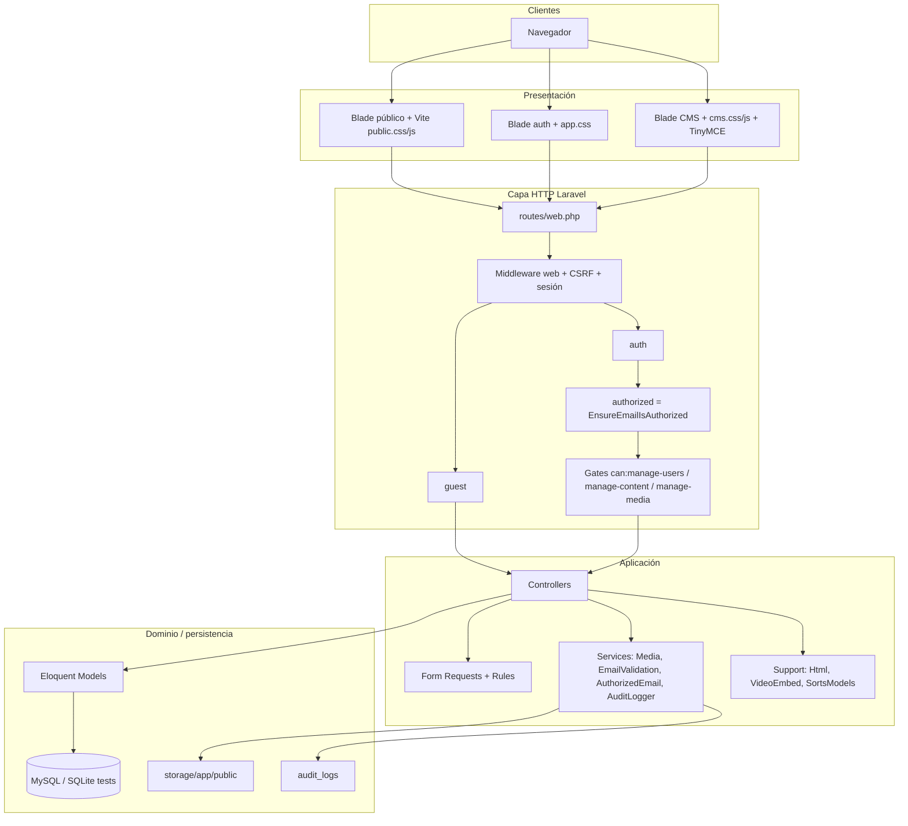
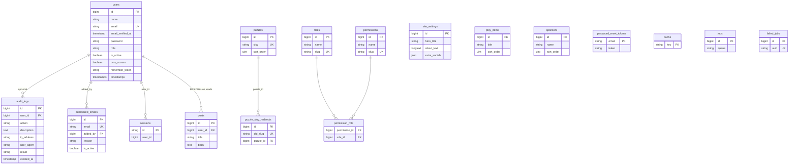
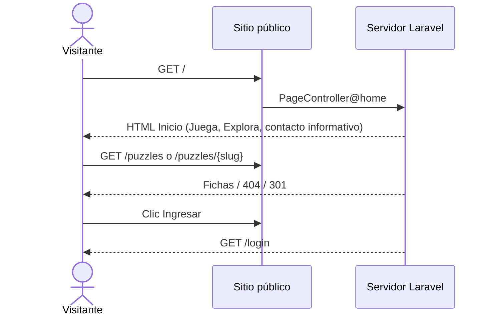
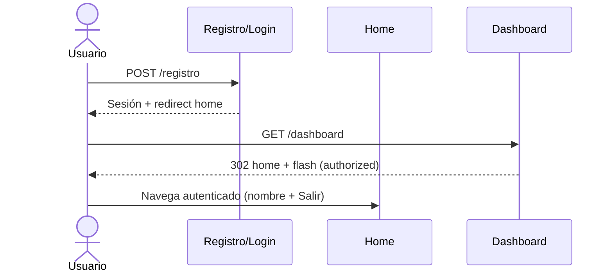
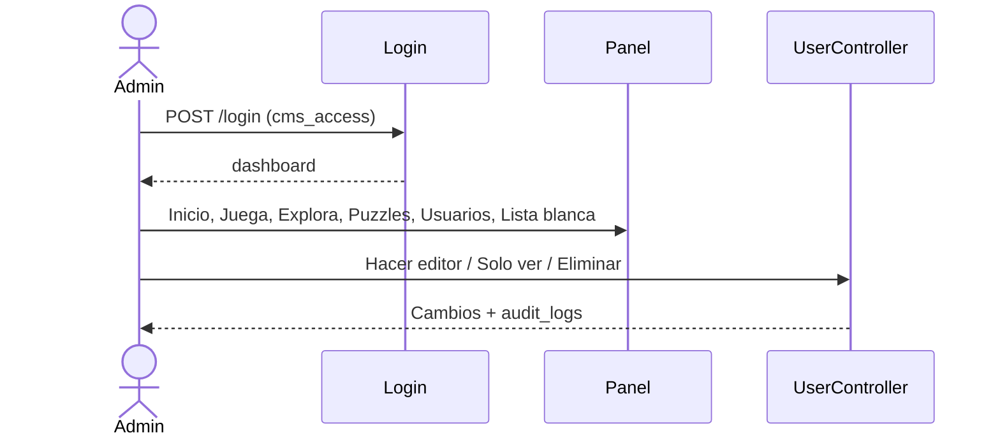

# Documento técnico del CMS Susurros Ancestrales

**Versión del documento:** 1.0  
**Fecha:** 11 de septiembre de 2026  
**Código analizado:** repositorio `cms_susurros_ancestrales`, Laravel 12.67.0  
**Audiencia:** desarrolladores, revisores de seguridad y agentes de IA que deban operar el sistema sin abrir el código.

Este documento describe el sistema **tal como está implementado**. Cuando una tabla, ruta o flujo de una guía genérica de CMS **no existe**, se indica explícitamente (no se inventa). Lo pendiente de decisión de negocio o de entorno se marca **PENDIENTE POR DEFINIR**.

---

## Tabla de contenido

1. [Visión general del sistema](#1-visión-general-del-sistema)
2. [Arquitectura del sistema](#2-arquitectura-del-sistema)
3. [Modelo de datos](#3-modelo-de-datos)
4. [Rutas del sistema](#4-rutas-del-sistema)
5. [Autenticación y autorización](#5-autenticación-y-autorización)
6. [Controladores y servicios](#6-controladores-y-servicios)
7. [Vistas y frontend](#7-vistas-y-frontend)
8. [Seguridad implementada](#8-seguridad-implementada)
9. [Flujos de usuario](#9-flujos-de-usuario)
10. [Configuración y despliegue](#10-configuración-y-despliegue)
11. [Pruebas](#11-pruebas)
12. [Glosario técnico](#12-glosario-técnico)
13. [Referencias](#13-referencias)

---

## 1. Visión general del sistema

### 1.1 Nombre del proyecto

- **Nombre de aplicación (`.env` / UI):** CMS Susurros Ancestrales / CMS Susurros Ancestrales  
- **Paquete Composer:** `laravel/laravel` (esqueleto Laravel; el producto es el CMS del videojuego)  
- **Producto público:** portal del videojuego **Susurros Ancestrales** (también referido como *Susurros ancestrales*)  
- **Repositorio:** proyecto Laravel en `cms_susurros_ancestrales`  
- **Contexto académico:** asignaturas *Desarrollo de Software Seguro* y *Seguridad en Aplicaciones*, Especialización en Seguridad de la Información, Universidad de Cundinamarca  

Identidad visual: design system **gia_stilo_colombiano** (paleta tricolor, tipografías Fraunces/Outfit, tema claro/oscuro).

### 1.2 Propósito y problema que resuelve

El equipo del videojuego necesita:

1. Un **sitio público** que presente el juego (hero, quiénes somos, módulos “Juega”, alianzas “Explora”, datos de contacto **sin formulario**, y fichas de puzzles territoriales).
2. Un **CMS autenticado** para que un administrador (y editores habilitados) actualicen ese contenido (textos, imágenes, videos, audio, orden de tarjetas) sin tocar código.
3. Un modelo de **cuentas públicas** (cualquier persona puede registrarse para ver el sitio logueada) y **acceso al CMS solo por habilitación explícita** del administrador (`cms_access`).
4. Controles de seguridad exigidos por el curso: CSRF, hashing, validación en servidor, rate limiting, auditoría, secretos fuera del código, mensajes de error genéricos.

### 1.3 Alcance

#### Incluye

- Sitio público: `/` (Inicio) y `/puzzles` (+ slug y alias `/puzzle/{slug}`).
- Autenticación por sesión: registro, login, logout.
- Panel CMS (`/dashboard` y `/cms/*`) para usuarios con `canAccessCms()`.
- Edición de: configuración de inicio (`site_settings`), ítems de Juega (`play_items`), patrocinadores/Explora (`sponsors`), puzzles (`puzzles`) con redirecciones de slug.
- Gestión de usuarios (solo admin): listar, convertir en editor / dejar solo ver la página, eliminar cuentas (no a sí mismo ni a admins).
- Lista blanca de correos (`authorized_emails`): administración CRUD; **no bloquea el registro ni el login público**. El acceso al CMS lo decide `users.cms_access` + rol + `is_active`.
- Auditoría de autenticación y acciones de administración de usuarios/lista blanca.
- Validación de correo en registro (formato, no desechable, comprobación de existencia de dominio MX/A si no está desactivada).
- Política de contraseña fuerte personalizada (mínimo 8, mayúscula, minúscula, número; lista de comunes; no contener nombre ni parte local del correo).
- Carga de medios en disco `public` (imágenes JPEG/PNG/WebP, audio MP3/WAV).
- Pruebas funcionales PHPUnit (24 casos al momento de este documento).

#### No incluye (explícitamente fuera de alcance o retirado)

| Capacidad esperada en un CMS genérico | Estado en este sistema |
|---------------------------------------|-------------------------|
| Blog / publicaciones (`posts` CRUD, `PostPolicy`) | **Retirado.** Existe migración residual `posts`; no hay modelo, rutas ni vistas. |
| Páginas estáticas Acerca / Contacto y formulario de contacto | **Retirado.** Las rutas `/acerca` y `/contacto` responden 404. El texto de contacto vive en Inicio. |
| Verificación de correo por enlace (MustVerifyEmail) | **Desactivado.** No hay rutas `/email/verify*`. El controlador y las vistas existen como código residual. |
| Recuperación de contraseña | **No implementado.** Existe tabla `password_reset_tokens` (esqueleto Laravel); no hay rutas ni UI. |
| API REST / Sanctum / `personal_access_tokens` | **No existe.** Solo rutas `web`. |
| Jobs asíncronos de negocio | Colas configuradas (`QUEUE_CONNECTION=database`) pero **no hay jobs de dominio**. |
| Multi-idioma i18n completo | Locale `es`; no hay archivos de traducción de producto. |
| El videojuego en sí (motor, APK real, servidor de juego) | Solo enlaces configurables (`run_button_url`, `android_apk_url`). **PENDIENTE POR DEFINIR** URLs definitivas de producción. |
| Roles RBAC leídos en runtime desde tablas `roles`/`permissions` | Tablas y seeders existen; **la autorización real usa columna `users.role` + Gates**. |

### 1.4 Público objetivo y organización

| Actor | Descripción |
|-------|-------------|
| Visitante anónimo | Público general interesado en el videojuego y los puzzles territoriales. |
| Usuario registrado (`role=usuario`, `cms_access=false`) | Persona con cuenta; ve el sitio; no entra al CMS. |
| Editor / autor con CMS | Miembro del equipo habilitado por un admin para editar contenido. |
| Administrador | Dueño del CMS: usuarios, lista blanca y todo el contenido. |

Tipo de organización: **estudio / proyecto de videojuego cultural colombiano** (Cundinamarca), con uso académico en un curso de software seguro. No es un CMS genérico de noticias empresariales.

### 1.5 Stack tecnológico completo (versiones)

| Componente | Versión / pin | Notas |
|------------|---------------|--------|
| PHP | `^8.2` (`composer.json`) | Versión exacta del binario local/XAMPP: **PENDIENTE POR DEFINIR** |
| Laravel Framework | **v12.67.0** (`composer.lock`) | Requisito `^12.0` |
| Laravel Tinker | `^2.10.1` | |
| PHPUnit | `^11.5.50` | Pruebas; no Pest, no Dusk |
| Laravel Pint | `^1.24` | Formato de código (dev) |
| Collision / Pail / Sail / Mockery / Faker | ver `composer.json` require-dev | Sail no es el flujo local documentado (se usa XAMPP) |
| MySQL | 8.x esperado | `.env.example`: `DB_CONNECTION=mysql`, puerto 3306 |
| MariaDB | Aceptable vía XAMPP | Versión exacta del XAMPP: **PENDIENTE POR DEFINIR** |
| SQLite | `:memory:` en PHPUnit | Solo tests |
| Blade | Incluido en Laravel 12 | |
| Vite | `^7.0.7` | `vite.config.js` |
| laravel-vite-plugin | `^2.0.0` | |
| Tailwind CSS | `^4.0.0` + `@tailwindcss/vite` | |
| Axios | `^1.11.0` | `resources/js/bootstrap.js` |
| Node.js | No hay campo `engines` | Vite 7 suele requerir Node 20.19+ o 22.12+. **PENDIENTE POR DEFINIR** versión usada |
| npm | Viene con Node | |
| Composer | Gestor PHP | Versión del CLI: **PENDIENTE POR DEFINIR** |
| Git | Control de versiones | Convención: Conventional Commits en español. Versión CLI: **PENDIENTE POR DEFINIR** |
| TinyMCE | 6.8.4 (CDN jsDelivr) | Solo layout CMS |
| GSAP | 3.12.5 (CDN) | Sitio público (carruseles / arrastre) |
| Hash de contraseñas | `bcrypt`, `BCRYPT_ROUNDS=12` (4 en tests) | Cast Eloquent `hashed` |

No hay Sanctum, Passport, Livewire, Inertia, Vue/React de aplicación, ni Redis obligatorio (está en `.env.example` como opcional).

### 1.6 Requisitos mínimos de servidor y entorno local

**Entorno local (documentado en README):**

- PHP 8.2+ con extensiones típicas de Laravel (OpenSSL, PDO, Mbstring, Tokenizer, XML, Ctype, JSON, BCMath, Fileinfo, GD recomendado para optimizar JPEG).
- Composer 2.x.
- Node.js + npm (compatible con Vite 7).
- MySQL 8 o MariaDB (XAMPP en Windows).
- Permiso para `php artisan storage:link`.
- Puerto 8000 para `php artisan serve` (o Apache de XAMPP apuntando a `public/`).

**Servidor de producción (recomendado; parte es PENDIENTE):**

- HTTPS obligatorio; `APP_DEBUG=false`; `APP_ENV=production`.
- PHP 8.2+ FPM o equivalente; `public/` como document root.
- MySQL/MariaDB con usuario de aplicación **sin privilegios de superusuario**.
- Disco persistente para `storage/app/public`.
- `SESSION_SECURE_COOKIE=true` detrás de HTTPS.
- Cola y cron: **PENDIENTE POR DEFINIR** (hoy no hay jobs de dominio ni comandos programados de negocio; solo `inspire`).
- Hosting concreto (VPS, cPanel, Forge, etc.): **PENDIENTE POR DEFINIR**.

---

## 2. Arquitectura del sistema

### 2.1 Diagrama de arquitectura



Vista ASCII equivalente:

```
USUARIO
  |
  v
NAVEGADOR (Blade + Vite + CDN GSAP/TinyMCE)
  |
  v
ROUTES web.php  (+ health /up)
  +-- público: home, puzzles
  +-- guest: login, registro (+ throttle)
  +-- auth: logout
  +-- auth + authorized: dashboard y /cms/*
        +-- can:manage-users
        +-- can:manage-content
        +-- can:manage-media
  |
  v
CONTROLLERS --> FormRequests / Rules --> Services / Support
  |
  v
MODELS (Eloquent) --> MySQL
                 --> audit_logs
                 --> archivos en disco public
```

### 2.2 Patrón arquitectónico

**MVC de Laravel** enriquecido con:

- **Services** de dominio acotados (`MediaService`, `EmailValidationService`, `AuthorizedEmailService`, `AuditLogger`).
- **Form Requests** para validación y autorización de entrada.
- **Rules** personalizadas de validación.
- **Gates** (no Policies): no hay carpeta `app/Policies`.
- **Middleware** de aplicación (`authorized`) además de `auth` / `guest` del framework.
- Clases **Support** (utilidades sin estado de negocio pesado).

No es hexagonal, CQRS ni event-sourcing. No hay capa de repositorios.

### 2.3 Capas y responsabilidades

| Capa | Ubicación | Responsabilidad |
|------|-----------|-----------------|
| Frontend | `resources/views`, `resources/css`, `resources/js` | Render, formularios, tema, carruseles, CSRF token meta |
| Routes | `routes/web.php`, `bootstrap/app.php` | Mapear HTTP → controlador; agrupar middleware; health `/up` |
| Middleware | Framework + `EnsureEmailIsAuthorized` | Sesión, cookies, CSRF, auth, guest, acceso CMS |
| Controllers | `app/Http/Controllers` | Orquestar request → validación → persistencia → redirect/view |
| Form Requests / Rules | `app/Http/Requests`, `app/Rules` | Validar y autorizar payloads |
| Services | `app/Services` | Medios, validación de email, lista blanca, auditoría (fachada) |
| Support | `app/Support` | Sanitizar HTML, embeds de video, reordenamiento |
| Models | `app/Models` | Mapeo Eloquent, `$fillable`, relaciones, helpers (`canAccessCms`) |
| Database | `database/migrations`, seeders | Esquema y datos iniciales |
| Audit | `audit_logs` + `AuditLog::record` | Trazas de auth y admin (no cubre cada CRUD de contenido) |
| Config | `config/*.php`, `.env` | Entorno, seguridad (`config/security.php`) |
| Tests | `tests/Feature`, `tests/Unit` | Contrato de comportamiento |

### 2.4 Flujo de una petición HTTP

Ejemplo: `POST /login` (invitado).

1. El navegador envía el formulario con cookie de sesión (si existe) y token `_token` CSRF.
2. El kernel HTTP de Laravel aplica el grupo `web`: cookies, sesión (`database` en local), `VerifyCsrfToken`, bindings.
3. La ruta exige middleware `guest` (si ya hay sesión, redirige a dashboard o `/` según `canAccessCms()` — ver `bootstrap/app.php` `redirectUsersTo`) y `throttle:login` (5/min por IP).
4. `LoginController::store` valida email/password.
5. `Auth::attempt` compara el hash bcrypt; no revela si el usuario existe.
6. Si falla: `AuditLog` `denied` y error genérico.
7. Si ok pero inactivo: logout + invalidate sesión + error genérico.
8. Si ok: `session()->regenerate()` (fija ID de sesión, mitiga fixation).
9. Redirección: CMS → `intended(dashboard)`; visitante → `home`.
10. Blade se renderiza en la siguiente GET; Vite sirve CSS/JS compilados o el servidor de desarrollo.

Ejemplo CMS: `PUT /cms/inicio` → `auth` → `authorized` (`canAccessCms`) → `can:manage-content` → `UpdateSiteSettingRequest` → sanitiza HTML → `MediaService` → `SiteSetting::update` → `back()` con flash `status`.

### 2.5 Decisiones arquitectónicas y justificación

| Decisión | Justificación |
|----------|----------------|
| Un solo `web.php`, sin API | El CMS y el portal son HTML/sesión; reduce superficie (no tokens). |
| `cms_access` booleano + `role` string | El registro es abierto; el admin decide quién edita. Más simple que un workflow de “solicitar rol”. |
| Gates en `AppServiceProvider` en vez de Policies | Pocos recursos; autorización por capacidad, no por instancia (cualquier editor edita cualquier puzzle). |
| Tablas `roles`/`permissions` sembradas pero no consultadas en Gates | Preparación para RBAC del curso; **hay divergencia**: la verdad operativa es `users.role`. |
| Contenido de “páginas” como fila única `site_settings` | Un home, no un árbol de páginas. |
| Medios en filesystem, no tabla `media` | Suficiente para el volumen actual; las rutas se guardan en columnas `*_path`. |
| No enviar correo de verificación | Requisito de producto: comprobar que el correo “exista” (sintaxis + MX opcional), no poseerlo. |
| Lista blanca desacoplada del login | Permite inventario de correos del equipo sin impedir cuentas públicas. Al “hacer editor” se añade el correo a la lista; al revocar se desactiva. |
| Mensajes genéricos de login/registro | Evitar enumeración de usuarios (OWASP). |
| HTML sanitizado con lista blanca de tags | TinyMCE introduce HTML; no se persiste crudo. |
| Rate limit de login por IP, no por email | Reduce complejidad; un atacante distribuido sigue siendo un riesgo residual. |
| Tests en SQLite memoria | Velocidad y aislamiento; riesgo: divergencias MySQL (JSON, FKs). |

---

## 3. Modelo de datos

### 3.1 Diagrama entidad-relación



**No hay** relación N:M `role_user`: el rol operativo está **desnormalizado** en `users.role`. Las filas de `roles` no se asignan a usuarios por FK.

### 3.2 Tablas del curso vs sistema real

| Tabla pedida en la plantilla | Estado |
|------------------------------|--------|
| `users` | Implementada (+ `role`, `is_active`, `cms_access`) |
| `roles` | Implementada; seeder; **no usada en Gates** |
| `permissions` | Implementada; seeder; **no usada en Gates** |
| `role_user` | **No existe** |
| `permission_role` | Implementada (N:M roles–permisos de catálogo) |
| `pages` | **No existe.** Equivalente: `site_settings` (1 fila) |
| `posts` | Migración residual **sin aplicación** |
| `services` | **No existe.** Equivalente: `play_items` |
| `media` | **No existe.** Archivos en disco + columnas path |
| `banners` | **No existe.** Equivalente parcial: `sponsors` y hero en settings |
| `audit_logs` | Implementada |
| `password_reset_tokens` | Esqueleto Laravel; **sin flujo** |
| `sessions` | Implementada; driver `database` en `.env.example` |
| `failed_jobs` | Esqueleto Laravel |
| `jobs` | Esqueleto + `job_batches` |
| `cache` | Esqueleto + `cache_locks` |
| `personal_access_tokens` | **No existe** (no Sanctum) |
| Extra de producto | `authorized_emails`, `site_settings`, `play_items`, `sponsors`, `puzzles`, `puzzle_slug_redirects` |

### 3.3 Detalle de cada tabla

Tipos según migraciones Laravel (MySQL: `id` = BIGINT UNSIGNED AI, `string` = VARCHAR, `boolean` = TINYINT(1), `timestamps` = `created_at`/`updated_at`).

#### 3.3.1 `users`

| Columna | Tipo | Restricciones |
|---------|------|----------------|
| id | bigint | PK, AI |
| name | string | not null |
| email | string | unique, not null |
| email_verified_at | timestamp | nullable (ya no se usa para acceso) |
| password | string | not null, hash bcrypt |
| remember_token | string | nullable |
| role | string(20) | default `'editor'` en migración; **la app crea usuarios con `usuario`** |
| is_active | boolean | default true |
| cms_access | boolean | default false |
| created_at, updated_at | timestamps | |

Índices: PK `id`; unique `email`.  
Valores de `role` usados en código: `admin`, `editor`, `autor`, `usuario`.

#### 3.3.2 `password_reset_tokens`

| Columna | Tipo | Restricciones |
|---------|------|----------------|
| email | string | PK |
| token | string | not null |
| created_at | timestamp | nullable |

**Sin rutas.** Flujo: no aplica.

#### 3.3.3 `sessions`

| Columna | Tipo | Restricciones |
|---------|------|----------------|
| id | string | PK |
| user_id | FK lógico bigint | nullable, index (no FK formal en migración) |
| ip_address | string(45) | nullable |
| user_agent | text | nullable |
| payload | longText | not null |
| last_activity | int | index |

#### 3.3.4 `cache` / `cache_locks`

`cache`: `key` PK, `value` mediumText, `expiration` int index.  
`cache_locks`: `key` PK, `owner` string, `expiration` int index.  
En tests: `CACHE_STORE=array` (no usa estas tablas).

#### 3.3.5 `jobs` / `job_batches` / `failed_jobs`

Estándar Laravel. `.env.example`: `QUEUE_CONNECTION=database`. Sin workers de producto.

#### 3.3.6 `posts` (residual)

| Columna | Tipo | Restricciones |
|---------|------|----------------|
| id | bigint | PK |
| user_id | FK users | cascadeOnDelete |
| title | string(150) | |
| body | text | |
| timestamps | | |

Relación 1:N users→posts **huérfana**.

#### 3.3.7 `site_settings`

Una fila de trabajo vía `SiteSetting::current()` (`firstOrCreate`).

| Columna | Tipo | Notas |
|---------|------|-------|
| id | bigint PK | |
| hero_title | string(150) | default Susurros Ancestrales |
| run_button_text | string(80) | default Run |
| run_button_url | string(500) | nullable, URL |
| android_button_text | string(80) | |
| android_apk_url | string(500) | nullable |
| about_title | string(150) | |
| about_text | longText | HTML sanitizado |
| about_image_path | string | path o URL absoluta |
| about_image_alt | string(200) | |
| contact_title | string(150) | |
| contact_email | string(150) | |
| contact_phone | string(80) | |
| facebook_url, instagram_url, twitter_url, youtube_url | string(500) | |
| address | string(255) | |
| contact_extra | longText | HTML sanitizado |
| extra_socials | json | array `{name, url}` |
| timestamps | | |

Sin FKs. Relación: 1 fila conceptual 1:1 con “el sitio”.

#### 3.3.8 `play_items`

| Columna | Tipo |
|---------|------|
| id | PK |
| title | string(150) |
| description | string(500) nullable |
| video_url | string(500) nullable |
| image_path | string nullable |
| sort_order | unsigned int default 0 |
| timestamps | |

Sin FKs. Ordenación manual.

#### 3.3.9 `sponsors`

| Columna | Tipo |
|---------|------|
| id | PK |
| name | string(150) |
| description | string(500) nullable |
| image_path | string nullable |
| website_url | string(500) nullable |
| phone | string(80) nullable |
| email | string(150) nullable |
| sort_order | unsigned int default 0 |
| timestamps | |

#### 3.3.10 `puzzles`

| Columna | Tipo | Restricciones |
|---------|------|----------------|
| id | PK | |
| name | string(150) | |
| slug | string(180) | unique, kebab-case |
| cover_image_path | string nullable | |
| short_description | string(500) nullable | |
| sort_order | unsigned int | |
| full_title | string(200) nullable | |
| description | longText nullable | HTML sanitizado |
| video_url | string(500) nullable | |
| audio_path | string nullable | |
| address | string(255) nullable | |
| coordinates | string(120) nullable | |
| maps_url | string(500) nullable | |
| benefits | longText nullable | HTML sanitizado |
| extra_image_path | string nullable | |
| cta_text | string(200) nullable | |
| cta_link | string(500) nullable | http(s), tel, mailto |
| timestamps | | |

#### 3.3.11 `puzzle_slug_redirects`

| Columna | Tipo | Restricciones |
|---------|------|----------------|
| id | PK | |
| old_slug | string(180) | unique |
| puzzle_id | FK puzzles | cascadeOnDelete |
| timestamps | | |

Relación N:1 hacia `puzzles`. Sirve 301 en el sitio público.

#### 3.3.12 `audit_logs`

| Columna | Tipo | Restricciones |
|---------|------|----------------|
| id | PK | |
| user_id | FK users | nullable, nullOnDelete |
| action | string | p.ej. `auth.login` |
| description | text nullable | |
| ip_address | string(45) nullable | |
| user_agent | string nullable | recortado a 255 |
| result | string(32) | default `ok`; también `denied` |
| created_at | timestamp | useCurrent; **sin `updated_at`** (`$timestamps = false`) |

Acciones observadas: `auth.register`, `auth.login`, `auth.logout`, `auth.access_denied`, `cms.user_access_granted`, `cms.user_access_revoked`, `cms.user_deleted`, `cms.authorized_email_*`. CRUD de play/sponsors/puzzles/settings **no** escribe auditoría.

#### 3.3.13 `authorized_emails`

| Columna | Tipo | Restricciones |
|---------|------|----------------|
| id | PK | |
| email | string | unique |
| added_by | FK users | nullable, nullOnDelete |
| reason | string nullable | |
| is_active | boolean | default true |
| timestamps | | |

#### 3.3.14 `roles` / `permissions` / `permission_role`

`roles`: id, name, slug unique, timestamps. Semilla: admin, editor, autor, usuario.  
`permissions`: id, name, slug unique. Semilla: manage-users, manage-content, manage-media.  
`permission_role`: PK compuesta (`permission_id`, `role_id`), FKs cascade.

Mapa sembrado:

| Rol | Permisos de catálogo |
|-----|----------------------|
| admin | manage-users, manage-content, manage-media |
| editor | manage-content, manage-media |
| autor | manage-content |
| usuario | ninguno |

**Importante:** `User::canAccessCms()` trata `autor` igual que `editor` para entrar al CMS, y los Gates `manage-content` y `manage-media` son ambos `canAccessCms()`. Por tanto un **autor con `cms_access` también puede gestionar puzzles**, a pesar del seeder que no le da `manage-media`. La tabla de permisos **no se consulta**.

### 3.4 Relaciones resumidas

| Relación | Cardinalidad | Cómo |
|----------|--------------|------|
| User → AuditLog | 1:N | `user_id` |
| User → AuthorizedEmail (quién añadió) | 1:N | `added_by` |
| User → Session | 1:N (lógica) | `sessions.user_id` |
| Puzzle → PuzzleSlugRedirect | 1:N | `puzzle_id` |
| Role ↔ Permission | N:M | `permission_role` |
| User ↔ Role (tabla) | **No modelada** | string `users.role` |
| SiteSetting / PlayItem / Sponsor | independientes | sin dueño |

### 3.5 Estrategia de migraciones y seeders

Orden cronológico de migraciones:

1. `0001_01_01_000000` users, password_reset_tokens, sessions  
2. `0001_01_01_000001` cache  
3. `0001_01_01_000002` jobs  
4. `2026_09_04_145514` posts (residual)  
5. `2026_09_05_000001` … `000005` contenido del portal  
6. `2026_09_11_000001` role en users  
7. `2026_09_11_000002` audit_logs  
8. `2026_09_11_100001` authorized_emails  
9. `2026_09_11_100002` description/result en audit_logs  
10. `2026_09_11_100003` is_active  
11. `2026_09_11_100004` roles y permissions  
12. `2026_09_11_120000` cms_access  

Comando: `php artisan migrate` (y `--seed`).

**Seeders:**

| Seeder | Efecto |
|--------|--------|
| `RoleSeeder` | 4 roles de catálogo |
| `PermissionSeeder` | 3 permisos + sync N:M |
| `DatabaseSeeder` | llama roles/permisos; crea admin `usuario@secureapp.test` / `Segura#2026!` con `cms_access=true` |
| `AuthorizedEmailSeeder` | `admin@example.com`, `usuario@secureapp.test` |
| `SiteContentSeeder` | textos, play items, sponsors, puzzles de demostración (imágenes de CodePen/Picsum) |

`UserFactory`: rol `usuario`, `cms_access` false, password factory `'password'` (solo tests). Estados `admin()`, `withCmsAccess()`, `unverified()`.

---

## 4. Rutas del sistema

Grupo implícito Laravel: middleware `web` (sesión, CSRF, cookies) en todas las de `web.php`.  
Health: `GET /up` (framework, `bootstrap/app.php`).  
No hay `routes/api.php` de aplicación.

### 4.1 Tabla completa

| Método | URI | Nombre | Controlador@acción | Middleware extra | Grupo | Permiso Gate |
|--------|-----|--------|-------------------|------------------|-------|--------------|
| GET | `/` | `home` | PageController@home | web | público | — |
| GET | `/puzzles` | `puzzles.index` | PageController@puzzles | web | público | — |
| GET | `/puzzles/{slug}` | `puzzles.show` | PageController@puzzles | web | público | — |
| GET | `/puzzle/{slug}` | `puzzles.alias` | PageController@puzzles | web | público | — |
| GET | `/registro` | `register` | RegisterController@create | guest | guest | — |
| POST | `/registro` | `register.store` | RegisterController@store | guest, throttle:register | guest | — |
| GET | `/register` | — | Redirect `/registro` | guest | guest | — |
| POST | `/register` | (sin name) | RegisterController@store | guest, throttle:register | guest | — |
| GET | `/login` | `login` | LoginController@create | guest | guest | — |
| POST | `/login` | `login.store` | LoginController@store | guest, throttle:login | guest | — |
| POST | `/logout` | `logout` | LoginController@destroy | auth | auth | — |
| GET | `/dashboard` | `dashboard` | DashboardController@index | auth, authorized | CMS | canAccessCms |
| GET | `/cms/usuarios` | `admin.users.index` | UserController@index | auth, authorized, can:manage-users | CMS admin | manage-users |
| PATCH | `/cms/usuarios/{user}/cms` | `admin.users.toggle-cms` | UserController@toggleCmsAccess | idem | CMS admin | manage-users |
| DELETE | `/cms/usuarios/{user}` | `admin.users.destroy` | UserController@destroy | idem | CMS admin | manage-users |
| GET | `/cms/correos-autorizados` | `admin.authorized-emails.index` | AuthorizedEmailController@index | idem | CMS admin | manage-users |
| POST | `/cms/correos-autorizados` | `admin.authorized-emails.store` | AuthorizedEmailController@store | idem | CMS admin | manage-users |
| PATCH | `/cms/correos-autorizados/{authorizedEmail}/toggle` | `admin.authorized-emails.toggle` | AuthorizedEmailController@toggle | idem | CMS admin | manage-users |
| DELETE | `/cms/correos-autorizados/{authorizedEmail}` | `admin.authorized-emails.destroy` | AuthorizedEmailController@destroy | idem | CMS admin | manage-users |
| GET | `/cms/inicio` | `admin.settings.edit` | SiteSettingController@edit | auth, authorized, can:manage-content | CMS | manage-content |
| PUT | `/cms/inicio` | `admin.settings.update` | SiteSettingController@update | idem | CMS | manage-content |
| GET | `/cms/play-items` | `admin.play-items.index` | PlayItemController@index | can:manage-content | CMS | manage-content |
| GET | `/cms/play-items/create` | `admin.play-items.create` | PlayItemController@create | idem | CMS | manage-content |
| POST | `/cms/play-items` | `admin.play-items.store` | PlayItemController@store | idem | CMS | manage-content |
| GET | `/cms/play-items/{play_item}/edit` | `admin.play-items.edit` | PlayItemController@edit | idem | CMS | manage-content |
| PUT/PATCH | `/cms/play-items/{play_item}` | `admin.play-items.update` | PlayItemController@update | idem | CMS | manage-content |
| DELETE | `/cms/play-items/{play_item}` | `admin.play-items.destroy` | PlayItemController@destroy | idem | CMS | manage-content |
| POST | `/cms/play-items/reorder` | `admin.play-items.reorder` | PlayItemController@reorder | idem | CMS | manage-content |
| GET | `/cms/sponsors` | `admin.sponsors.index` | SponsorController@index | can:manage-content | CMS | manage-content |
| GET | `/cms/sponsors/create` | `admin.sponsors.create` | create | idem | CMS | manage-content |
| POST | `/cms/sponsors` | `admin.sponsors.store` | store | idem | CMS | manage-content |
| GET | `/cms/sponsors/{sponsor}/edit` | `admin.sponsors.edit` | edit | idem | CMS | manage-content |
| PUT/PATCH | `/cms/sponsors/{sponsor}` | `admin.sponsors.update` | update | idem | CMS | manage-content |
| DELETE | `/cms/sponsors/{sponsor}` | `admin.sponsors.destroy` | destroy | idem | CMS | manage-content |
| POST | `/cms/sponsors/reorder` | `admin.sponsors.reorder` | reorder | idem | CMS | manage-content |
| GET | `/cms/puzzles` | `admin.puzzles.index` | PuzzleController@index | can:manage-media | CMS | manage-media |
| GET | `/cms/puzzles/create` | `admin.puzzles.create` | create | idem | CMS | manage-media |
| POST | `/cms/puzzles` | `admin.puzzles.store` | store | idem | CMS | manage-media |
| GET | `/cms/puzzles/{puzzle}/edit` | `admin.puzzles.edit` | edit | idem | CMS | manage-media |
| PUT/PATCH | `/cms/puzzles/{puzzle}` | `admin.puzzles.update` | update | idem | CMS | manage-media |
| DELETE | `/cms/puzzles/{puzzle}` | `admin.puzzles.destroy` | destroy | idem | CMS | manage-media |
| POST | `/cms/puzzles/reorder` | `admin.puzzles.reorder` | reorder | idem | CMS | manage-media |
| GET | `/up` | — | Laravel health | — | infra | — |

`Route::resource(...)->except(['show'])`: no hay SHOW de recursos CMS.

### 4.2 Públicas vs protegidas

- **Públicas:** home, puzzles (cualquier slug válido), health.  
- **Solo invitados (`guest`):** login y registro. Un usuario autenticado que visite `/login` es redirigido a `/dashboard` si tiene CMS o a `/` si no.  
- **Autenticadas:** logout.  
- **Autenticadas + CMS:** dashboard y `/cms/*`. Sin `cms_access` se redirige a home **manteniendo la sesión**.  
- **403 Forbidden:** editor/autor intentando Usuarios o lista blanca (`can:manage-users`).

### 4.3 `guest` y `auth`

- `guest`: impide ver login/registro si ya hay sesión (evita doble login).  
- `auth`: exige sesión; si no, redirección a ruta `login`.  
- Alias `authorized`: **no** comprueba la lista blanca; comprueba `User::canAccessCms()`.

### 4.4 Rate limiting

Definido en `AppServiceProvider`:

| Nombre | Límite | Clave | Rutas |
|--------|--------|-------|-------|
| `login` | 5 por minuto (`config/security.php`) | IP | POST `/login` |
| `register` | 20 por hora | IP | POST `/registro` y POST `/register` |
| `verification` | 5 por hora | user id o IP | **Ninguna ruta lo usa** (residual) |

Al superar: HTTP **429**.

No hay throttle de contacto (el formulario se eliminó).

---

## 5. Autenticación y autorización

### 5.1 Diferencia de conceptos (con ejemplos)

| Concepto | Definición | Ejemplo en este CMS |
|----------|------------|---------------------|
| Autenticación | Probar quién eres | `Auth::attempt` en login; sesión `web` |
| Autorización | Qué puedes hacer ya autenticado | Gate `manage-users`; middleware `authorized` |
| Rol | Etiqueta de tipo de cuenta | `users.role = admin\|editor\|autor\|usuario` |
| Permiso | Capacidad nombrada | Catálogo `manage-content`; en runtime los Gates **no leen** la tabla, usan `isAdmin()` / `canAccessCms()` |

### 5.2 Flujo de registro (paso a paso)

1. GET `/registro` (guest) → vista `auth.register`.  
2. Usuario envía name, email, password, password_confirmation + CSRF.  
3. `throttle:register`.  
4. `RegisterUserRequest`:
   - Normaliza email a minúsculas.
   - name: required, 2–100.
   - email: formato, `RealEmailRule` (filter_var + no disposable + MX/A salvo skip), `NotDisposableEmailRule`.
   - Unique comprobado en `withValidator` (mensaje genérico, no “el email ya existe”).
   - password: confirmed + `StrongPasswordRule`.
5. `User::create` con `Hash::make`, `role=usuario`, `is_active=true`, `cms_access=false`. El cast `hashed` también hashearía; se llama `Hash::make` explícitamente (doble hash no ocurre porque el mutator detecta hashes existentes en Laravel hashed cast cuando ya es bcrypt — **el código usa Hash::make + cast hashed**: Laravel 11+ hashed cast no rehasea un hash bcrypt válido).  
6. `Auth::login` + `session()->regenerate()`.  
7. Audit `auth.register`.  
8. Redirect `home` con flash: cuenta creada; el CMS lo habilita un admin.  
9. **No se envía correo.**

### 5.3 Flujo de login (paso a paso)

1. GET `/login` → `auth.login`.  
2. POST validación `email` required|email, `password` required.  
3. Email a minúsculas.  
4. `Auth::attempt` (+ remember opcional).  
5. Fallo → audit denied + “No fue posible iniciar sesión.”  
6. Éxito pero `!is_active` o `!hasActiveRole()` → logout, invalidate, regenerateToken, mismo mensaje genérico.  
7. Éxito → regenerate ID de sesión, audit ok.  
8. `canAccessCms()` → `redirect()->intended(dashboard)`; si no → home con mensaje.

### 5.4 Flujo de logout

1. POST `/logout` + CSRF, middleware auth.  
2. Captura usuario para audit.  
3. `Auth::logout()`.  
4. `session()->invalidate()` + `regenerateToken()` (nuevo CSRF).  
5. Audit `auth.logout`.  
6. Redirect `login`.

### 5.5 Recuperación de contraseña

**No aplica.** Tabla vacía de uso. **PENDIENTE POR DEFINIR** si el curso exigirá “Olvidé mi contraseña”.

### 5.6 Hash y sesiones

- Guard `web`, provider Eloquent `User`.  
- Passwords: bcrypt, rounds 12 (`.env` `BCRYPT_ROUNDS`).  
- Verificación: `Auth::attempt` / `Hash::check` interno.  
- Sesión driver `database`, lifetime 120 min, `http_only` true, `same_site` lax, `secure` según `SESSION_SECURE_COOKIE` (null en local).  
- `encrypt` de payload de sesión: false por defecto.  
- Regeneración: login y registro; invalidate en logout y denegación por cuenta inactiva.

### 5.7 Middleware `auth`, `guest`, `verified`

- `auth` y `guest`: en uso.  
- `verified` (**EnsureEmailIsVerified**): clase existe (extiende la de Laravel) **pero no está en `web.php`**. User no implementa `MustVerifyEmail`.  
- `authorized`: alias en `bootstrap/app.php`.

### 5.8 Policies y Gates

**Policies:** ninguna.

**Gates** (`AppServiceProvider`):

```text
manage-users    => $user->isAdmin()
manage-content  => $user->canAccessCms()
manage-media    => $user->canAccessCms()
```

`canAccessCms()`:

```text
is_active AND cms_access AND role IN (admin, editor, autor)
```

Un `usuario` con `cms_access=true` **no** entra al CMS hasta que el toggle le ponga rol `editor`.

Reglas extra en controlador (no Gates):

- No toggle CMS sobre uno mismo (403).  
- No eliminar a uno mismo ni a un admin (403).

### 5.9 Roles y permisos: definición, asignación, verificación

**Definición:** constantes en `User` + filas sembradas en `roles`/`permissions`.

**Asignación:**

- Registro: `usuario`, sin CMS.  
- Seeder: admin de prueba con CMS.  
- Admin en UI: “Hacer editor” pone `cms_access=true`, `role=editor`, añade email a lista blanca activa.  
- “Dejar solo ver la página”: `cms_access=false`, `role=usuario`, desactiva fila de lista blanca.  
- No hay UI para promover a admin ni a autor.

**Verificación:** `$user->isAdmin()`, `$user->canAccessCms()`, `@can('manage-users')`, `middleware('can:...')`.

---

## 6. Controladores y servicios

### 6.1 Lista de controladores y métodos

#### PageController

| Método | Entrada | Validación | Lógica | Salida | Excepciones |
|--------|---------|------------|--------|--------|-------------|
| home | GET / | — | Carga settings, play items, sponsors; duplica cards hasta ≥10 para loop visual | view `public.home` | — |
| puzzles | GET, slug opcional | — | Si slug es old_slug → 301 al slug actual; lista puzzles; slug inválido → 404 | view o redirect | 404 |

#### RegisterController

| Método | Entrada | Validación | Salida |
|--------|---------|------------|--------|
| create | GET | — | view register |
| store | POST campos registro | RegisterUserRequest | redirect home; sesión iniciada |

Errores de validación: 302 back con sesión errors.

#### LoginController

| Método | Entrada | Lógica | Salida |
|--------|---------|--------|--------|
| create | GET | — | view login |
| store | POST email/password/remember | attempt + checks | dashboard, home, o back errors |
| destroy | POST | logout | login |
| deny (privado) | — | logout + audit | usado internamente |

#### DashboardController

| Método | Lógica | Salida |
|--------|--------|--------|
| index | Conteos users/play/sponsors/puzzles; 6 audit logs | `admin.dashboard` |

#### UserController

| Método | Entrada | Lógica | Salida | Excepciones |
|--------|---------|--------|--------|-------------|
| index | — | lista users latest | `admin.users.index` | 403 si no admin (middleware) |
| toggleCmsAccess | PATCH user | flip cms_access; editor vs usuario; whitelist | back status | 403 si es el mismo user |
| destroy | DELETE user | borra whitelist y user | back | 403 self o isAdmin |

#### AuthorizedEmailController

| Método | Lógica | Salida |
|--------|--------|--------|
| index | listAll | vista |
| store | service add + audit | back |
| toggle | flip is_active + audit | back |
| destroy | service remove + audit | back |

StoreAuthorizedEmailRequest: authorize `can('manage-users')`.

#### SiteSettingController

| Método | Lógica | Salida |
|--------|--------|--------|
| edit | current settings | `admin.settings.edit` |
| update | sanitize HTML, replace image, extra_socials | back |

#### PlayItemController / SponsorController / PuzzleController

CRUD estándar + `reorder` JSON `{ ok: true }`. Destroy borra archivos vía MediaService. Puzzle update crea redirect de slug.

#### EmailVerificationController (residual)

Métodos `notice`, `verify`, `send`. **Sin rutas.** No forma parte del flujo actual.

#### Controller base

Vacío; no traits.

### 6.2 Form Requests y reglas

| Clase | Autoriza | Reglas clave |
|-------|----------|----------------|
| RegisterUserRequest | true | name, email+Real+NotDisposable, password confirmed+Strong; unique manual |
| StoreAuthorizedEmailRequest | manage-users | email, reason |
| UpdateSiteSettingRequest | user !== null | textos, URLs, imagen 4MB jpg/png/webp, extra_socials max 12 |
| StorePlayItemRequest | user | title, description, video url, image required en POST |
| StoreSponsorRequest | user | name, contactos, image required en POST |
| StorePuzzleRequest | user | slug unique regex kebab, audio 20MB, cta_link esquema, cover required POST |
| ReorderRequest | user | ids array de enteros |

Duplicados no Admin en `app/Http/Requests/StorePlayItemRequest.php` etc.: **código residual no referenciado por controladores actuales.**

**Rules:**

- `RealEmailRule` → `EmailValidationService::isRealEmail`  
- `NotDisposableEmailRule`  
- `StrongPasswordRule` (min config 8, mixed case, digit, common list, no name/email local)  
- `AuthorizedEmailRule` — **no usada en registro/login actuales**

`SECURITY_CHECK_UNCOMPROMISED`: existe en config; **StrongPasswordRule no llama** `Password::uncompromised()`.

### 6.3 Servicios de dominio

| Servicio | Responsabilidad |
|----------|-----------------|
| MediaService | store/replace/delete/url imágenes y audio; resize JPEG max 1600px calidad 82 |
| EmailValidationService | formato, disposable list, MX/A/`dns_get_record`; skip MX en testing o `SECURITY_SKIP_MX` |
| AuthorizedEmailService | add/updateOrCreate, remove, isAuthorized, listAll |
| AuditLogger | fachada estática a `AuditLog::record` |

### 6.4 Manejo de errores

- Validación: 422 vía redirect 302 + `$errors` (web).  
- 401/redirect login: no autenticado en rutas auth.  
- 403: Gates y abort_if.  
- 404: puzzle slug desconocido; rutas retiradas.  
- 429: throttle.  
- Excepciones no capturadas: página Laravel; en producción con `APP_DEBUG=false` no se exponen stacks.  
- `bootstrap/app.php` `withExceptions`: vacío (default framework).  
- Login/registro: mensajes genéricos deliberados.  
- HTML: `Html::sanitize` strip_tags + href seguros.

Notificaciones `AccountStatusNotification` y `UnauthorizedAccessNotification`: **definidas, no disparadas** en los controladores actuales.

---

## 7. Vistas y frontend

### 7.1 Lista de vistas Blade

| Vista | Uso |
|-------|-----|
| `layouts/public.blade.php` | Layout sitio (nav Inicio, Puzzles, CMS condicional, login/salir, tema) |
| `layouts/cms.blade.php` | Layout panel (sidebar, @can, TinyMCE, logout) |
| `layouts/app.blade.php` | Layout genérico residual / auth histórico |
| `public/home.blade.php` | Inicio público |
| `public/puzzles.blade.php` | Listado/detalle puzzles |
| `auth/login.blade.php` | Login |
| `auth/register.blade.php` | Registro |
| `auth/verify-email.blade.php` | Residual, no enrutada |
| `emails/verify.blade.php` | Residual |
| `admin/dashboard.blade.php` | Métricas y logs |
| `admin/users/index.blade.php` | Usuarios |
| `admin/authorized-emails/index.blade.php` | Lista blanca |
| `admin/settings/edit.blade.php` | Editar inicio |
| `admin/play-items/index.blade.php` | Listado Juega |
| `admin/play-items/form.blade.php` | Alta/edición |
| `admin/sponsors/index.blade.php` | Explora |
| `admin/sponsors/form.blade.php` | Alta/edición |
| `admin/puzzles/index.blade.php` | Puzzles CMS |
| `admin/puzzles/form.blade.php` | Alta/edición |
| `welcome.blade.php` | Esqueleto Laravel, **no enrutada** |

No hay componentes Blade `x-` de aplicación ni carpeta `partials` formal; formularios de recursos son vistas `form`.

### 7.2 Layouts, directivas

- `@vite([...])` en public, cms y auth.  
- `@csrf` en todos los POST/PUT/PATCH/DELETE.  
- `@can('manage-users'|...)` en sidebar CMS.  
- `@auth` / `@else` (guest) en nav público.  
- `{{ }}` escape; HTML de CMS se imprime con `{!! !!}` **solo** tras `Html::sanitize` en contenidos ricos (**verificar en home/puzzles al mantener código**).  
- `csrf-token` meta para JS (reordenamientos).

### 7.3 Assets Vite

Entradas (`vite.config.js`):

- `resources/css/app.css` + `resources/js/app.js` (auth; app.js importa bootstrap, login.js, theme)  
- `resources/css/public.css` + `resources/js/public.js`  
- `resources/css/cms.css` + `resources/js/cms.js`  
- Extra CSS: `resources/css/auth/login.css` (importado desde app.css o login)

Tailwind 4 vía plugin Vite. `refresh: true`. Watch ignora compiled Blade en storage.

CDN: GSAP público; TinyMCE CMS. Dependencia de terceros y SRI: **no hay SRI** — riesgo de supply chain.

### 7.4 Formularios: cliente vs servidor

Cliente: `required`, `maxlength`, `type=email`, confirmación de password solo visual; toggle mostrar password.  
Servidor: Form Requests (autoridad). Un atacante puede omitir `required` HTML.

Reorder: POST JSON de ids (cms.js) + CSRF header.

### 7.5 Responsive y accesibilidad

- Viewport meta; paleta y tipografías del design system.  
- Nav y tablas CMS: usables en desktop; **PENDIENTE POR DEFINIR** auditoría WCAG formal.  
- `aria-label` en toggle de tema público; `role="alert"` en errores de registro.  
- TinyMCE: accesibilidad limitada (widget de terceros).  
- Contraste tema oscuro/claro vía `data-theme` y `localStorage`.

---

## 8. Seguridad implementada

### 8.1 Controles aplicados

| Control | Implementación |
|---------|----------------|
| CSRF | Middleware web + `@csrf` + meta token |
| Hash passwords | bcrypt + cast `hashed` + `Hash::make` |
| Validación servidor | Form Requests / `$request->validate` |
| Unique email | índice unique + check en registro con mensaje genérico |
| Unique slug puzzles | Rule::unique |
| Rate limiting | login 5/min IP; register 20/h IP |
| Regeneración de sesión | login, registro; invalidate logout |
| Mass assignment | `$fillable` en modelos |
| XSS | Blade `{{ }}`; sanitize HTML CMS; href allowlist |
| SQLi | Eloquent/query builder; no SQL concatenado de usuario |
| Política de password | StrongPasswordRule (no `Password::min(8)->letters()...` del framework; equivalente custom + comunes + anti-nombre) |
| Errores genéricos | login/registro |
| Secretos | `.env` no versionado; `.env.example` sin APP_KEY |
| Cookies | HttpOnly; SameSite=lax; Secure **PENDIENTE** en prod |
| Autorización CMS | middleware + Gates |
| Enumeración de emails | unique no revela “ya registrado” con mensaje distinto |
| Uploads | mimes + max size; store en disco public (nombres Laravel) |
| Open redirect CTA | regex `https?://`, `tel:`, `mailto:` en puzzles |
| Video embed | YouTube/Vimeo parseado a iframe src conocido |
| Debug | `APP_DEBUG=true` en example local; debe ser false en prod |
| Headers seguridad (HSTS, CSP) | **PENDIENTE POR DEFINIR** (no hay middleware CSP custom) |
| HTTPS | **PENDIENTE** entorno de despliegue |
| 2FA | **No implementado** |
| Password uncompromised (HIBP) | Flag config, **no aplicado** |
| Verificación de posesión de email | **No implementada** (decisión de producto) |

### 8.2 Amenazas consideradas (threat model resumido)

| Amenaza (OWASP / STRIDE) | Control | Residual |
|--------------------------|---------|----------|
| CSRF | tokens | AJAX debe enviar header |
| XSS almacenado en TinyMCE | sanitize | bypass de tags no cubiertos |
| XSS reflejado | Blade escape | `{!! !!}` mal usado en vistas futuras |
| SQLi | Eloquent | — |
| Fuerza bruta login | 5/min IP | botnet multi-IP |
| Registro masivo | 20/h IP | misma limitación |
| Session fixation | regenerate | — |
| Session hijack | HttpOnly; falta Secure/HTTPS | MITM en HTTP |
| Mass assignment role=admin | fillable incluye `role` pero create de registro fija valores; riesgo si otro endpoint usa `User::create($request->all())` | no hay tal endpoint hoy |
| Privilege escalation | Gates + abort self-delete | autor = editor en Gates |
| IDOR puzzles CMS | cualquier editor edita cualquier ficha (diseño, no bug) | — |
| Path traversal upload | Storage Laravel | — |
| Archivos maliciosos SVG/HTML | mimes imagen no svg | — |
| Enumeración usuarios | mensajes genéricos | timing residual |
| Correo falso | MX opcional; skip MX true en Windows | emails inventados con dominio real |
| Lista blanca ignorada en login | intencional | no es control de acceso CMS |
| Dependencias CDN | TinyMCE/GSAP | compromiso del CDN |
| Información en logs | audit IP/UA | PII en BD |
| Tabla posts residual | no expuesta | superficie de esquema |
| APP_KEY leak | .env | si se commitea, rehacer key |

### 8.3 Contraseñas vs guía Laravel `Password::`

La guía del curso menciona `Password::min(8)->letters()->mixedCase()->numbers()`.  
Este sistema implementa lo mismo (y más: comunes, nombre, email) en `StrongPasswordRule`. **No exige símbolo** (el admin de seeder sí tiene `#`). Uncompromised desactivado.

---

## 9. Flujos de usuario

### 9.1 Visitante (no autenticado)



Puede registrarse o iniciar sesión. No ve enlace CMS.

### 9.2 Usuario registrado (solo ver la página)



### 9.3 Administrador



Credencial seeder: `usuario@secureapp.test` / `Segura#2026!`.

### 9.4 Editor

Login → dashboard. Sidebar: contenido y puzzles; **no** Usuarios ni lista blanca (403 si fuerza URL). Toggle de otros usuarios: no.

### 9.5 Autor

En catálogo sembrado, autor no tiene `manage-media`. En runtime, si `cms_access` y `role=autor`, `canAccessCms()` es true y **sí** pasa `can:manage-media`.  
**No hay UI para crear autores.** Flujo práctico: **PENDIENTE POR DEFINIR** (rol de catálogo vs comportamiento real).

---

## 10. Configuración y despliegue

### 10.1 Variables de entorno (`.env.example`)

| Variable | Ejemplo / default | Propósito |
|----------|-------------------|-----------|
| APP_NAME | CMS Susurros Ancestrales | Nombre y cookie de sesión |
| APP_ENV | local | production en despliegue |
| APP_KEY | vacío | `php artisan key:generate` |
| APP_DEBUG | true | **false en producción** |
| APP_URL | http://localhost:8000 | URLs, Vite, correos |
| APP_LOCALE / FALLBACK / FAKER | es / es / es_ES | |
| BCRYPT_ROUNDS | 12 | coste hash |
| LOG_* | stack, debug | |
| DB_CONNECTION | mysql | sqlite en tests |
| DB_HOST/PORT/DATABASE/USERNAME/PASSWORD | 127.0.0.1, 3306, cms_susurros_ancestrales, root, vacío | |
| SESSION_DRIVER | database | array en tests |
| SESSION_LIFETIME | 120 | minutos |
| SESSION_ENCRYPT | false | |
| FILESYSTEM_DISK | local | public disk para media |
| QUEUE_CONNECTION | database | sync en tests |
| CACHE_STORE | database | array en tests |
| MAIL_* | log | array en tests; **correo de producto no se usa en flujos actuales** |
| SECURITY_ADMIN_EMAIL | admin@example.com | config; notificaciones residuales |
| SECURITY_SKIP_MX | true | no exigir DNS MX (Windows/XAMPP) |
| SECURITY_CHECK_UNCOMPROMISED | false | no HIBP |
| AWS_* | vacíos | no usados por el CMS |
| VITE_APP_NAME | ${APP_NAME} | frontend |
| REDIS_* | opcionales | no requeridos |

`SESSION_SECURE_COOKIE` no está en `.env.example`: **PENDIENTE** documentar `true` en HTTPS.

### 10.2 Instalación paso a paso

```bash
composer install
copy .env.example .env
php artisan key:generate
php artisan migrate --seed
php artisan storage:link
npm install
npm run build
```

Ejecución: `composer run dev` (serve + queue listen + pail + vite) o `php artisan serve` + `npm run dev`. URL: `http://localhost:8000`.

Con XAMPP: crear BD `cms_susurros_ancestrales`, vhost a `public/`.

### 10.3 Migración y seed

```bash
php artisan migrate
php artisan migrate --seed
php artisan db:seed
php artisan migrate:fresh --seed   # destruye datos
```

Tests: `php artisan test` (RefreshDatabase + sqlite memory).

### 10.4 Vite

`npm run dev` / `npm run build`. Plugin Laravel + Tailwind. No proxy especial.

### 10.5 Base de datos

Charset/collation: defaults Laravel MySQL (`utf8mb4`).  
Usuario root sin password en example: **solo local**. Producción: usuario dedicado. **PENDIENTE POR DEFINIR** backup y retención de `audit_logs`.

### 10.6 Correo

`MAIL_MAILER=log` en desarrollo. Verificación y notificaciones de cuenta **no se envían** en el flujo vigente. Si se reactivan, configurar SMTP real. **PENDIENTE POR DEFINIR** proveedor.

### 10.7 Producción y seguridad

1. `APP_ENV=production`, `APP_DEBUG=false`, `APP_URL` HTTPS.  
2. `php artisan config:cache` / `route:cache` / `view:cache` / `event:cache`.  
3. `npm run build`; no servir `npm run dev`.  
4. Document root = `public/`.  
5. Permisos: `storage` y `bootstrap/cache` escribibles; código no escribible por www-data innecesariamente.  
6. `SESSION_SECURE_COOKIE=true`, considerar `SESSION_SAME_SITE=lax|strict`.  
7. Rotar `APP_KEY` solo con plan de re-encriptar (hoy sesión encrypt=false).  
8. No versionar `.env`.  
9. `composer audit` / `npm audit`.  
10. Rate limit adicional en reverse proxy.  
11. CSP y HSTS en el servidor web.  
12. Copias de `storage/app/public`.  
13. Quitar o no indexar `/up` según política.  
14. Cambiar password del usuario seeder.  
15. `SECURITY_SKIP_MX=false` si el DNS del servidor funciona.  
16. Eliminar o no migrar tabla `posts` residual. **PENDIENTE** decisión.

---

## 11. Pruebas

### 11.1 Herramientas

- **PHPUnit 11** (`php artisan test`).  
- **Pest:** no.  
- **Dusk / browser tests:** no.  
- `RefreshDatabase` en Feature.  
- Entorno: sqlite memory, mail array, cache/session array, BCRYPT_ROUNDS=4.

### 11.2 Pruebas funcionales (Feature)

| Clase | Caso | Esperado |
|-------|------|----------|
| ExampleTest | GET `/`, `/puzzles`, slug demo | 200 |
| ExampleTest | `/acerca`, `/contacto` | 404 |
| ExampleTest | `/dashboard` guest | redirect login |
| RegisterTest | email real | redirect home, autenticado, role usuario, sin CMS, dashboard→home |
| RegisterTest | mailinator | errors email |
| RegisterTest | password débil | errors password |
| RegisterTest | password contiene nombre | errors password |
| LoginTest | usuario CMS | redirect dashboard, GET 200 |
| LoginTest | credenciales malas | generic errors email |
| LoginTest | sin cms_access | home, dashboard→home |
| LoginTest | 6º intento | 429 |
| MiddlewareTest | guest dashboard | login |
| MiddlewareTest | user sin CMS | home, sigue autenticado |
| MiddlewareTest | cms user | 200 dashboard |
| RegisterAndAuthorizationTest | editor users.index | 403; play-items 200 |
| RegisterAndAuthorizationTest | admin users | 200 |
| RegisterAndAuthorizationTest | GET /register | redirect /registro |
| AuthorizedEmailTest | CRUD lista blanca admin | ok / toggle / delete |
| AuthorizedEmailTest | editor whitelist | 403 |
| SecurityFlowsTest | guest dashboard | login |
| SecurityFlowsTest | seed + password mala | errors |
| SecurityFlowsTest | login CMS | dashboard |
| UserCmsAccessTest | grant/revoke | dashboard ok luego home |
| UserCmsAccessTest | delete user | missing en BD |
| UserCmsAccessTest | toggle propio | 403 |
| Unit ExampleTest | true is true | pasa |

### 11.3 Pruebas de seguridad cubiertas

Fuerza bruta (429), mensajes genéricos, guest isolation, separación editor/admin, toggle/delete reglas, emails desechables, password policy, registro no otorga CMS.

**No cubierto por tests automatizados:** CSRF token missing, XSS stored, upload malicioso, SQL injection, HTTPS, 403 puzzle reorder sin auth (implícito middleware), autorización autor vs editor.

### 11.4 Resultados esperados

Al cierre de este documento: **24 tests, 74 assertions, PASS**.  
Comando: `php artisan test` o `composer test`.

---

## 12. Glosario técnico

| Término | Definición |
|---------|------------|
| CMS | Sistema de gestión de contenido del portal Susurros Ancestrales |
| Susurros Ancestrales | Nombre comercial del videojuego / marca del sitio |
| gia_stilo_colombiano | Design system visual del curso/proyecto |
| Blade | Motor de plantillas de Laravel |
| Vite | Bundler de CSS/JS en desarrollo y build |
| Eloquent | ORM de Laravel |
| Gate | Autorización booleana nombrada (`Gate::define`) |
| Policy | Clase de autorización por modelo; **no usadas** |
| Form Request | Clase que valida (y autoriza) un HTTP request |
| Middleware | Filtro del pipeline HTTP |
| CSRF | Cross-Site Request Forgery; token `_token` |
| XSS | Cross-Site Scripting |
| Mass assignment | Asignar atributos masivos; mitigado con `$fillable` |
| `cms_access` | Flag que, con rol de equipo y cuenta activa, permite el panel |
| Lista blanca | Tabla `authorized_emails`; inventario, no candado de login |
| MX | Registro DNS de correo; usado para “¿existe el dominio?” |
| Disposable email | Correo temporal (mailinator, etc.) |
| Audit log | Traza de acciones de seguridad/admin |
| Throttle | Rate limiting Laravel |
| Session fixation | Atacar reutilizando ID de sesión; se mitiga con `regenerate()` |
| TinyMCE | Editor WYSIWYG en el CMS |
| GSAP | Librería de animación del home |
| Seeder | Carga de datos iniciales |
| Factory | Generador de modelos para tests |
| Route model binding | `{user}` → instancia `User` |
| intended() | Redirect a URL intentada tras login |
| Health `/up` | Probe de vida de Laravel 11+ |

**Acrónimos:** MVC, ORM, HTTP, URI, FK, PK, UI, UX, API, SMTP, CDN, OWASP, NIST, CSP, HSTS, SRI, RBAC, PII, JSON, GDPR (**aplicabilidad PENDIENTE POR DEFINIR**).

---

## 13. Referencias

### 13.1 Laravel 12.x

- Documentación: https://laravel.com/docs/12.x  
- Routing: https://laravel.com/docs/12.x/routing  
- Middleware: https://laravel.com/docs/12.x/middleware  
- Authentication: https://laravel.com/docs/12.x/authentication  
- Authorization (Gates): https://laravel.com/docs/12.x/authorization  
- Validation: https://laravel.com/docs/12.x/validation  
- Eloquent: https://laravel.com/docs/12.x/eloquent  
- Security / hashing: https://laravel.com/docs/12.x/hashing  
- Vite: https://laravel.com/docs/12.x/vite  
- Rate limiting: https://laravel.com/docs/12.x/routing#rate-limiting  

### 13.2 OWASP

- OWASP Top 10: https://owasp.org/www-project-top-ten/  
- A01 Broken Access Control — Gates, cms_access, 403  
- A02 Cryptographic Failures — bcrypt, HTTPS pendiente  
- A03 Injection — Eloquent, sanitize HTML  
- A04 Insecure Design — registro abierto + habilitación admin  
- A05 Security Misconfiguration — APP_DEBUG, headers  
- A07 Identification and Authentication Failures — throttle, session regenerate, password policy  
- A09 Security Logging Failures — audit_logs parcial  

### 13.3 NIST

- NIST SP 800-63B (identidad digital / contraseñas): alineación parcial (longitud, no secretos comunes; sin 2FA ni verificación de email).  
- NIST SP 800-53 (AU, AC, SC): auditoría, control de acceso, protección de comunicaciones — **cobertura parcial**.  
- URL: https://csrc.nist.gov/publications  

### 13.4 Jira / Atlassian

- Jira Software (gestión de trabajo): https://www.atlassian.com/software/jira  
- **PENDIENTE POR DEFINIR:** proyecto Jira, epics, issues y Definition of Done de este CMS. Este repositorio no incluye integración Jira.

### 13.5 Internos del repo

- `README.md` (parcialmente desactualizado respecto a Acerca/Contacto/Posts)  
- `docs/arquitectura.md`  
- `docs/auditoria-guias.md` (si está presente en el checkout)  
- `.env.example`  
- `config/security.php`  
- `routes/web.php`  

---

## Apéndice A — Código residual (no forma parte del flujo vigente)

Para no confundir a un implementador:

- `EmailVerificationController`, `auth/verify-email`, `emails/verify`, `VerifyAccountNotification`  
- `EnsureEmailIsVerified` sin alias de ruta  
- Rate limiter `verification`  
- `AccountStatusNotification`, `UnauthorizedAccessNotification`  
- `AuthorizedEmailRule` sin uso en auth actual  
- Form Requests duplicados fuera de `Admin/`  
- Vista `welcome.blade.php`  
- Tabla y migración `posts`  
- Métodos de notificación de verificación  

Pueden eliminarse en una limpieza o reactivarse si el curso lo exige.

## Apéndice B — Usuario de demostración

| Campo | Valor |
|-------|--------|
| Nombre | Usuario de Prueba |
| Correo | usuario@secureapp.test |
| Contraseña | Segura#2026! |
| Rol | admin |
| CMS | sí |

**No usar esta contraseña en producción.**

---

*Fin del documento técnico. Cualquier desviación futura del código debe actualizar este archivo en el mismo commit que el cambio de comportamiento.*
